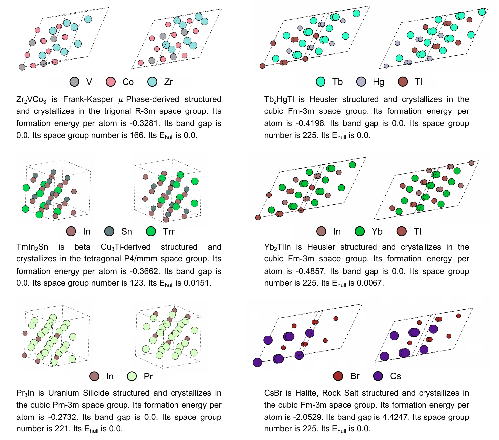

# TFMat: Text-Conditioned Flow Matching for Crystal Structure Generation

[](LICENSE)
[](https://www.python.org/downloads/)
[](https://pytorch.org/)

TFMat extends CrystalFlow by introducing text-conditioned flow matching for crystal structure generation. The model maps structured material descriptions to semantic condition vectors and uses them to guide continuous flow from noise to target crystal structures.

## Highlights

- **91.33%** match rate on Perov-5 (single-sample, +37.64% over baseline)
- **46.40%** match rate on Carbon-24 (single-sample, +31.38% over baseline)
- **77.80%** match rate on MP-20 (single-sample, +10.15% over baseline)
- **92.04%** match rate on MP-20 (num_eval=20, highest among all methods)
- Best distributional fidelity on MP-20 de novo generation

## Key Features

- **Text-conditioned generation**: Uses MatSciBERT to encode structural prototypes, symmetry information, and scalar properties
- **Flow matching backbone**: Predicts lattice and fractional-coordinate velocities along continuous trajectories
- **Classifier-free guidance**: Enables flexible control over generation through guidance factors
- **Dual-mode operation**: Supports both crystal structure prediction (CSP) and de novo generation (DNG)

## Performance

### Crystal Structure Prediction (Single-Sample)

| Dataset | CrystalFlow | TFMat | Improvement |
|---------|-------------|-------|-------------|
| Perov-5 | 53.69% | **91.33%** | +37.64% |
| Carbon-24 | 15.02% | **46.40%** | +31.38% |
| MP-20 | 67.65% | **77.80%** | +10.15% |

### MP-20 with num_eval=20

- **TFMat**: 92.04% (highest)
- TGDMat (Long): 82.02%
- CrystalFlow: 85.38%

### De Novo Generation on MP-20

- **Number of Elements EMD**: 0.1990 (best)
- **Density EMD**: 0.0794 (best)
- **Structural Validity**: 99.06%
- **Coverage Precision**: 99.67%

## Visualizations

### Text-Conditioned De Novo Generation

<p align="center">
  
</p>

*Text-conditioned de novo generation: ground-truth versus TFMat-generated crystals. Each pair shows the reference structure (left) and the crystal produced by TFMat when conditioned solely on the corresponding textual description (right). The text encodes prototype name, space group, formation energy and band gap, yet no explicit atomic coordinates are provided to the model.*

## Installation

### Requirements

- Python 3.11+
- PyTorch 2.3+
- CUDA 12.1+ (for GPU training)

### Setup

```bash
# Create conda environment
conda create -n tfmat python=3.11.9
conda activate tfmat

# Install PyTorch and PyG
pip install torch==2.3.1 torchvision torchaudio --index-url https://download.pytorch.org/whl/cu121
pip install torch_geometric==2.5.3
pip install pyg_lib torch_scatter torch_sparse torch_cluster torch_spline_conv -f https://data.pyg.org/whl/torch-2.3.0+cu121.html

# Install core dependencies
pip install lightning==2.3.2 finetuning_scheduler
pip install hydra-core omegaconf python-dotenv wandb rich
pip install p_tqdm pymatgen pyxtal smact matminer einops chemparse torchdyn
pip install transformers

# Install package
pip install -e .

# Create directories
mkdir -p log hydra
```

### Environment Configuration

Create a `.env` file:

```bash
cp .env.template .env
```

Edit `.env` to specify:

```bash
export PROJECT_ROOT="/path/to/CrystalFlow"
export HYDRA_JOBS="/path/to/CrystalFlow/hydra"
export WANDB_DIR="/path/to/CrystalFlow/log"
```

## Quick Start

### Training

#### CSP with Text Conditioning (MP-20)

```bash
CUDA_VISIBLE_DEVICES=0 python diffcsp/run.py \
  data=mp_20_text \
  model=flow_polar_text \
  data.train_max_epochs=2000 \
  optim.optimizer.lr=1e-3 \
  +model.lattice_polar_sigma=0.1 \
  model.cost_coord=10 \
  model.cost_lattice=1 \
  logging.wandb.mode=online \
  expname=CSP-mp20-text
```

#### DNG with Text Conditioning (MP-20)

```bash
CUDA_VISIBLE_DEVICES=0,1,2,3 python diffcsp/run.py \
  train.pl_trainer.devices=4 \
  data=mp_20_text \
  model=flow_polar_w_type \
  data.train_max_epochs=2000 \
  +model.type_encoding=table \
  optim.optimizer.lr=1e-3 \
  +model.lattice_polar_sigma=0.1 \
  model.cost_type=10 \
  model.cost_coord=10 \
  model.cost_lattice=1 \
  logging.wandb.mode=online \
  expname=DNG-mp20-text
```

For DNG, text conditioning is supplied by `data=mp_20_text`; the corresponding
model configuration is `flow_polar_w_type`.

### Evaluation

#### CSP Evaluation (Single Sample)

```bash
python scripts/evaluate.py \
  --model_path <checkpoint_path> \
  --dataset mp_20 \
  --ode-int-steps 100 \
  --anneal_coords \
  --anneal_slope 10 \
  --guidance_factor auto \
  --label tfmat_s100_a10

python scripts/compute_metrics.py \
  --root_path <checkpoint_dir> \
  --tasks csp \
  --gt_file data_text/mp_20/test.csv \
  --label tfmat_s100_a10
```

#### DNG Evaluation

```bash
python scripts/generation.py \
  --model_path <checkpoint_path> \
  --dataset mp_20 \
  --ode-int-steps 100 \
  --anneal_coords \
  --anneal_slope 10 \
  --guidance_factor auto \
  --label tfmat_dng_s100_a10

python scripts/compute_metrics.py \
  --root_path <checkpoint_dir> \
  --tasks gen \
  --gt_file data_text/mp_20/test.csv \
  --label tfmat_dng_s100_a10
```

## Text Conditioning Format

Text descriptions follow this structure:

```
Prototype: <prototype_name>, Space Group: <space_group_number>, 
Formation Energy: <value> eV/atom, Band Gap: <value> eV
```

Example:
```
Prototype: rocksalt, Space Group: 225, Formation Energy: -2.34 eV/atom, Band Gap: 2.1 eV
```

## Key Hyperparameters

### Sampling Configuration

- **ODE steps**: 100 (balance between quality and speed)
- **Annealing slope**: 10 (coordinate refinement strength)
- **Guidance factor**: auto (adaptive classifier-free guidance)

### Training Configuration

- **Condition dropout**: 0.1 (enables classifier-free guidance)
- **Text encoder**: MatSciBERT (frozen)
- **Condition dimension**: 768 (MatSciBERT hidden size)

## Baseline vs Text-Conditioned

### Baseline (CrystalFlow)

```bash
data=mp_20 + model=flow_polar
Condition: formation_energy_per_atom
```

### Text-Conditioned (TFMat)

```bash
data=mp_20_text + model=flow_polar_text
Condition: text_embedding (768-dim MatSciBERT)
Key techniques:
  - Classifier-free guidance (gamma=auto)
  - Condition dropout (p=0.1)
  - Precomputed text embeddings
```

## Analysis Scripts

### Property Prediction Validation

```bash
# Train CGCNN surrogate models
python scripts/compute_text_prompt_match_with_cgcnn.py \
  --generated_file <generated_structures.pt> \
  --test_file data_text/mp_20/test.csv

# Plot property distributions
python scripts/plot_property_distributions.py \
  --generated_file <generated_structures.pt> \
  --test_file data_text/mp_20/test.csv
```

### Element Composition Analysis

```bash
python scripts/compute_element_composition_match.py \
  --generated_file <generated_structures.pt> \
  --test_file data_text/mp_20/test.csv \
  --top_k 2000
```

### t-SNE Visualization

```bash
python scripts/plot_text_embedding_tsne.py \
  --baseline_file <crystalflow_generated.pt> \
  --text_file <tfmat_generated.pt> \
  --test_file data_text/mp_20/test.csv
```

## Project Structure

```
CrystalFlow/
├── conf/                      # Hydra configuration files
│   ├── data/                  # Dataset configs (mp_20_text, etc.)
│   ├── model/                 # Model configs (flow_polar_text, etc.)
│   ├── optim/                 # Optimizer configs
│   └── train/                 # Training configs
├── diffcsp/                   # Core model implementation
│   ├── pl_modules/            # PyTorch Lightning modules
│   ├── pl_data/               # Data modules
│   └── run.py                 # Main training script
├── scripts/                   # Evaluation and analysis scripts
│   ├── evaluate.py            # CSP evaluation
│   ├── generation.py          # DNG evaluation
│   ├── compute_metrics.py     # Metric computation
│   └── *.py                   # Analysis scripts
├── docs/                      # Documentation
│   ├── *.png                  # Visualization figures
│   ├── main.tex               # Paper manuscript
│   ├── TRAINING_EVALUATION_GUIDE.md  # Training guide
│   └── PROJECT_STRUCTURE.md   # Project structure
└── result/                    # Evaluation results
    ├── results-1.csv          # Single-sample results
    └── results-20.csv         # Multi-sample results
```

## Important Notes

### Analysis Scripts

Some analysis scripts require experimental results to be generated first:
- `plot_property_distributions.py` - Requires top2000 results file
- `compute_element_composition_match.py` - Requires generated CIF files
- `plot_text_embedding_tsne.py` - Requires generated structures

**Workflow**: Run evaluation scripts first to generate these files, then run analysis scripts.

### Training with Hydra

Always specify the data configuration when running training:

```bash
# ✓ Correct
python diffcsp/run.py data=mp_20_text model=flow_polar_text

# ✗ Incorrect (will fail)
python diffcsp/run.py --help
```

### PyTorch Geometric Warnings

You may see warnings about `pyg-lib` and `torch-sparse`. These do not affect core functionality but may impact performance of certain graph operations.

## Data and Checkpoints

Due to size constraints, datasets and model checkpoints are not included in this repository.

### Datasets

Text-annotated datasets can be obtained by:
1. Contacting the authors
2. Preparing your own datasets following the format described in [docs/PROJECT_STRUCTURE.md](docs/PROJECT_STRUCTURE.md)

### Pre-trained Checkpoints

Model checkpoints will be made available upon paper acceptance.

## Documentation

- [Training and Evaluation Guide](docs/TRAINING_EVALUATION_GUIDE.md) - Detailed guide on Baseline vs Text-Conditioned training
- [Project Structure](docs/PROJECT_STRUCTURE.md) - Codebase organization and architecture
- [Test Report](TEST_REPORT.md) - Testing results and usage notes

## Citation

If you use TFMat in your research, please cite:

```bibtex
@article{tfmat2024,
  title={TFMat: Text-Conditioned Flow Matching for Crystal Structure Generation},
  author={Anonymous},
  journal={arXiv preprint},
  year={2024}
}
```

Also cite the original CrystalFlow paper:

```bibtex
@article{luo2024crystalflow,
  title={CrystalFlow: A Flow-Based Generative Model for Crystalline Materials},
  author={Luo, Xiaoshan and others},
  journal={arXiv preprint arXiv:2412.11693},
  year={2024}
}
```

## Acknowledgments

This work builds upon:
- [CrystalFlow](https://github.com/ixsluo/CrystalFlow): Base flow matching framework
- [DiffCSP](https://github.com/txie-93/cdvae): Training infrastructure
- [CDVAE](https://github.com/txie-93/cdvae): Benchmark datasets
- [MatSciBERT](https://huggingface.co/m3rg-iitd/matscibert): Text encoder

## License

This project is licensed under the MIT License - see the [LICENSE](LICENSE) file for details.

## Contact

For questions or issues, please open a GitHub issue or contact the authors.
